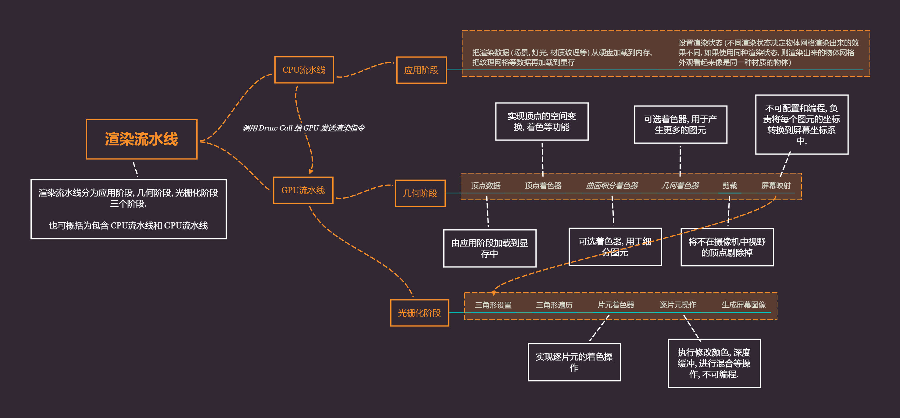
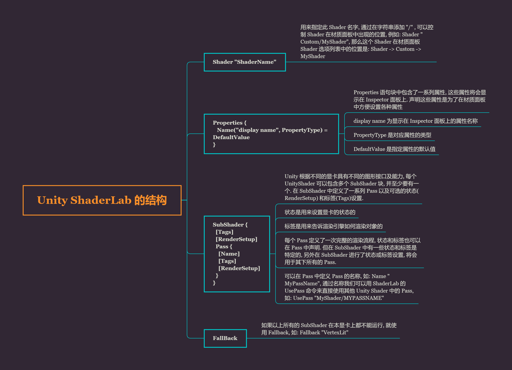

# Unity Shader 的学习笔记

# 1. 基本 Shader

1.1 shader 是运行在 GPU 上的程序.

1.2 目前主流针对 GPU 编程的技术有:

- HLSL: 微软研发, 只能供 Direct3D 使用.
- GLSL: 是用来在 OpenGL 中编程的着色器语言
- CG: NVIDIA 和微软合作开发, 独立的三维编程接口, 不依赖于 D3D 和 OpenGL, 可以和这两种图形渲染库结合起来使用.

1.3 Unity 中的着色器可以分为三类

- 固定管线着色器: 为了兼容老一代 GPU 而设计, 最早的图形学版本都是基于这个着色器来编写
- 顶点片元着色器: 比固定管线着色器要新, 功能强大, 可编程, 缺点是不支持光照
- 表面着色器: Unity 官方推荐的着色器, 可编程, 支持光照, 自定义光照模型, 自由度高

1.4 Unity shader 编程语言:

ShaderLab 基本语法结构:

```glsl
Shader "name" {
    [Properties] // 属性
    Subshaders {} // 子着色器
    [Fallback] // 降级着色器
}
```

1.4.1 在 Properties 块中代表的是着色器中使用到的所有属怀, 这些参数可以在 Inspector 中进行编辑和调整.

Properies 的示例语法:

```glsl
属性名("Inspector显示的名字", 数据类型) = 初始值
数据类型有:
Range(min, max), Float, Int, Color(num, num, num, num), Vector(num, num, num, num), 2D, 3D 等
```

真正用于呈现渲染的代码都放在 SubShader 块, 其主要由可选标签, 通用状态以及一个通道列表构成.

每个 Shader 都包含一个 SubShader 列表, 游戏运行时会根据实际的运行环境从上到下选择一个合适的 SubShader 来使用. 


1.4.2 SubShader 语法结构:

```glsl
SubShader {
    [Tags]
    [CommonState]
    Pass {}
}
```

重要的代码和核心渲染逻辑基本都在 Pass 块中, 一个 SubShader 可以包含多个 Pass 块, Pass 的语法:

```glsl
Pass {
    [Name and Tags]
    [RenderSetup] // 可以设置显卡的各种状态
    // 例如:
    // Lighting (光照, 开启或者关闭对应 On 和 Off)
    // Material {材质块}
    // SeparateSpecular (开启或者关闭顶点光照相关的镜面高光颜色, 允许高光有不同的颜色)
    [TextureSetup]
}
```

1.4.3 最后是使用降级着色器 Fallback , 作用是当编写的 Shader 无法完成渲染任务时备选的渲染方案, 以防渲染程序报错崩溃.

# 2. 镂空透明

早期做 3D 模型时会用到透明贴图来表现人物模型头发镂空的效果, 具体讲究"黑透白不透", 意为用一张带 alpha 通道的黑白贴图做 mask 遮罩, 黑色的部分表示透明, 白色的部分表示不透明. 将这张特殊的贴图放到三维软件特殊的通道上即可实现模型的镂空透明的效果.

Shader 里的镂空透明效果和上面有一定联系, 大致就是利用 alpha 的混合, 两种不同的重叠的色值按照一定的比例混合, 得到一个最终颜色. 当这两个重叠的颜色中有一个颜色的混合系数为零, 那么重叠的部分就只会显示另一种颜色. 即, 这个混合系数为零的颜色被另一个颜色遮挡一样, 相对的当上方的颜色混合系数为零, 那么就只显示下方的颜色了, 这样就实现了透明的效果.

```glsl
Shader "Custom/Shader2"
{
    Properties
    {
        _Color("Color", Color) = (1, 1, 1, 1) // 设置主颜色
        _MainTex("Albedo(RGB)", 2D) = "white"{} // 设置主纹理
    }
    SubShader
    {
        // 使用透明队列渲染标签
        Tags{"Queue" = "Transparent"}
        Pass
        {
            // 定义材质
            Material
            {
                Diffuse[_Color] // 漫反射
                Ambient[_Color] // 环境光
            }
            // 使用 Alpha 混合功能必须要预先开启, 使用 Blend 指令
            Blend SrcAlpha OneMinusSrcAlpha
            // 开启标准顶点光照
            Lighting On
            // 纹理设置
            SetTexture[_MainTex]
            {
                constantColor[_Color]
                Combine texture*primary DOUBLE, texture*constant
            }
        }
    }
    Fallback "Diffuse"
}
```

这里的 Material 代码块可以将 Properties 块中的属性值绑定到固定函数光照材质设置上. SetTexture 代码块定义了我们想要使用的纹理以及如何在渲染中混合, 组合和应用这些纹理.

我们设置一个恒定的颜色值, 即材质的颜色: _Color. 之后用 Combine 命令执行将纹理和颜色值混合, 通常写为 `Combine ColorPart, AlphaPart`, 这里的 ColorPart 和 AlphaPart 分别定义颜色(RGB)和Alpha(A) 分量的混合, AlphaPart 可以省略.

上面代码中的 `Combine texture*primary DOUBLE, texture*constant` 这里的 texture 是来自当前纹理 (_MainTex) 的颜色, 它与 primary 顶点颜色相乘 (*). 主色是顶点光照颜色, 根据上面的材质值计算得出, 最后将结果乘以 2 来增加光照强度 (DOUBLE). Alpha 值则是由 `texture * constant`(constant 是 constantColor 设置的).

和 Standard Shader 相比, 当 Standard Shader 的 Rendering Mode 选择为 Transparent 后, 也会有镂空效果, 并且场景中的光线可以在平面上产生相对应穿过物体透明部分的阴影, 但目前我们自己编写的 Shader 影子还是实心的, 这里涉及到光照阴影处理部分, 后面再研究.

# 3. AlphaTest

AlphaTest 通俗来讲就是给定一个 Alpha 阈值, 之后在给定一个测试公式, Alpha 阈值配合 Alpha 测试公式对屏幕上所有的像素点进行测试, 通过测试的像素点就保留, 没有通过测试的像素点就会被拣选掉. 

比如, 有一个红色的值为 ColorRed(255, 0, 0), 紫色的值为 ColorPurple(255, 0, 255). 此时我们给定一个 Alpha 阈值为 125, 拟定一个测试公式是 `Color.Green > Alpha 阈值`, 即颜色的 Green 数值大于 Alpha 阈值. 之后就用这个阈值和测试公式对屏幕上所有像素点进行测试, 通过测试的就留下, 没有通过的就被拣选掉. 此时, 因为红色和紫色的 G 数值为 0 , 因此结果就是都没有通过测试, 此时屏幕上就看不见红色和紫色, 只能看见屏幕中的背景了.

# 4. 渲染流水线



ShaderLab 的结构



## Properties

| 属性类型        | 默认值的定义语法                 | 例子                                     |
| --------------- | -------------------------------- | ---------------------------------------- |
| Int             | number                           | _Int("int", Int) = 2                     |
| Float           | number                           | _Float("float", Float) = 1.5             |
| Range(min, max) | number                           | _Range("Range", Range(0.0, 5.0)) = 3.0   |
| Color           | (number, number, number, number) | _Color("Color", Color) = (1, 1, 1, 1)    |
| Vector          | (number, number, number, number) | _Vector("Vector", Vector) = (2, 3, 6, 1) |
| 2D              | "defaulttexture" {}              | _2D("2D", 2D) = ""{}                     |
| Cube            | "defaulttexture" {}              | _Cube("Cube", Cube) = "white" {}         |
| 3D              | "defaulttexture" {}              | _3D("3D", 3D) = "black" {}               |

对于 2D, Cube, 3D 这3种纹理类型定义要稍微复杂些, 它们的默认值是通过一个字符串后跟一对花括号来指定的. 其中字符串要么是空, 要么是内置的纹理名称, 如: "white", "black" "gray" 或者 "bump", 花括号的用处原本是用于指定一些纹理属性的, 但现在已经被移除了. 如有需要, 则要自己在顶点着色器中编写计算相应的纹理坐标代码.

## RenderSetup

| 状态名称 | 设置指令                                               | 解释                                 |
| -------- | ------------------------------------------------------ | ------------------------------------ |
| Cull     | Cull Back/Front/Off                                    | 设置剔除模式, 剔除背面/正面/关闭剔除 |
| ZTest    | ZTest Less/Greater/LEqual/GEqual/Equal/NotEqual/Always | 设置深度测试时使用的函数             |
| ZWrite   | Zwrite On/Off                                          | 开启/关闭深度写入                    |
| Blend    | Blend SrcFactor DstFactor                              | 开启并设置混合模式                   |

## Tags

| SubShader 标签类型   | 说明                                                         | 例子例子例子例子例子例子例子例子例子例子例子例子例子例子例子例子例子例子例子例子例子例子例子例子例子例子例子 |
| -------------------- | ------------------------------------------------------------ | ------------------------------------------------------------ |
| Queue                | 控制渲染顺序, 指定该物体属于哪一个渲染队列, 可用于指定所有透明物体在不透明物体后面被渲染. | Tags{"Queue" = "Transparent"}                                |
| RenderType           | 对着色器进行分类, 可以被用于着色器替换功能.                  | Tags{"RenderType" = "Opaque"}                                |
| DisableBatching      | 一些 SubShader 在使用批处理功能时会出现问题, 例如使用了模型空间下的坐标进行顶点动画, 这时可以用这个标签来指定是否使用批处理. | Tags{"DisableBatching" = "True"}                             |
| ForceNoShadowCasting | 控制使用该 SubShader 的物体是否会投射阴影.                   | Tags{"ForceNoShadowCasting" = "True"}                        |
| IgnoreProjector      | 通常用于半透明物体, 如果为 True, 那么使用该 SubShader 的物体将不会受 projector 的影响. | Tags{"IgnoreProjector" = "True"}                             |
| CanUseSpriteAtlas    | 当该 SubShader 是用于 sprite 时, 将该标签设为 False.         | Tags{"CanUseSpriteAtlas" = "False"}                          |
| PreviewType          | 指定材质面板如何预览材质, 默认显示一个球形, 可以将该标签的值设置为 "Plane", "SkyBox" 来改变预览类型. | Tags{"PreviewType" = "Plane"}                                |

## Pass Tags

| Pass 标签类型  | 说明                                      | 例子                                       |
| -------------- | ----------------------------------------- | ------------------------------------------ |
| LightMode      | 定义该 Pass 在 Unity 的渲染流水线中的角色 | Tags{"LightMode" = "ForwardBase"}          |
| RequireOptions | 用于指定当满足某些条件时才渲染该 Pass     | Tags{"RequireOptions" = "SoftVergetation"} |

# 5. 三种 Shader 类型

## 5.1 表面着色器

Unity 自己创造的一种 Shader 类型, 目的是为了使用者操作更加的方便, 相较于原本的 Shader 要写的代码要少很多. 实际上当 Unity 要编译一个表面着色器时背后还是要转换成对应的顶点/片元着色器.

一个简单的表面着色器如下:

```glsl
Shader "Custom/testShader"
{
    SubShader
    {
        Tags{"RenderType" = "Opaque"}
        CGPROGRAM
        #pragma surface surf Lambert
        struct Input
        {
            float4 color:COLOR;
        };
        void surf (Input IN, inout SurfaceOutput o)
        {
            o.Albedo = 1;
        }
        ENDCG
    }
    FallBack "Diffuse"
}
```

表面着色器被定义在 SubShader 中的 CGPROGRAM 和 ENDCG 之间, 这其中的代码是使用 CG/HLSL 写的, 这与实际上的 CG/HLSL 代码几乎是一样的. 当然你也可以使用 GLSL 来写, 跟 CG/HLSL 类似, GLSL 的代码要嵌套在 GLSLPROGRAM 和 ENDGLSL 中, 这就限制了能发布的平台, 只能放在 MacOSX, OpenGLES2.0 等, 放在 DirectX 平台上就不适用了.

## 5.2 顶点/片元着色器

相比表面着色器要复杂一些, 但灵活性也是更高. 顶点/片元着色器代码也是写在 CGPROGRAM 和 ENDCG 之间, 但是是在 Pass 块中而不是在 SubShader 块, 这就需要我们自己去写代码定义每个 Pass 块的功能, 这样我们可以控制实际渲染的细节, 代码也是用 CG/HLSL 编写的.

一个简单的顶点/片元着色器:

```glsl
Shader "Custom/testShader"
{
    SubShader
    {
        Pass
        {
            CGPROGRAM
            #pragma vertex vert
            #pragma fragment frag
            float4 vert(float4 v : POSITION) : SV_POSITION
            {
                return UnityObjectToClipPos (v);
            }
            fixed4 frag() : SV_Target
            {
                return fixed4(1.0, 0.0, 0.0, 1.0);
            }
            ENDCG
        }
    }
}
```

## 5.3 固定函数着色器

一般是用在比较陈旧的设备上, 这些设备不支持可编程管线着色器, 固定函数着色器的编写需要完全使用 ShaderLab 的语法而不是 CG/HLSL. 现在大多数 GPU 都支持可编程渲染, 所以固定管线也就慢慢被淘汰了.

一个简单的固定函数代码:

```glsl
Shader "Custom/testShader"
{
    Properties
    {
        _Color ("Main Color", Color) = (1, 0.5, 0.5, 1)
    }
    SubShader
    {
        Pass
        {
            Material
            {
                Diffuse[_Color]
            }
            Lighting On
        }
    }
}
```

# 6. 涉及的数学知识

## 6.1 笛卡尔坐标系

笛卡尔坐标系有二维和三维. 二维笛卡尔坐标系包含一个原点, 以及过原点并相互垂直的两条向量, 也就是 X轴和 Y轴. 这是我们一般意义上的二维笛卡尔坐标系, 而 OpenGL 和 DirectX 使用了不同的二维笛卡尔坐标系:

- DirectX 在进行屏幕映射时使用的 2D笛卡尔坐标系, 是以左上角为坐标原点.
- OpenGL 在进行屏幕映射时使用的 2D笛卡尔坐标素, 是以左下角为坐标原点.

三维笛卡尔坐标系是定义了三个坐标轴和原点, 三个向量相交于原点并相互垂直, 坐标轴也称为该坐标系的基矢量. 当各个向量长度为1时称为标准正交基, 当向量长度不为1的时候称为正交基. 三维笛卡尔坐标系也有两种情况: 左手坐标系和右手坐标系.

在 Unity 中, 场景里面的世界坐标是以左手坐标系为主, 但摄像机观察视锥空间是以右手坐标系为主, Z轴刚好与世界坐标系相反.

## 6.2 点, 向量和标量

点是多维空间中的一个位置, 没有大小. 一般用2到3个实数来表示, 如P(Px, Py), 表示二维空间中的点, P(Px, Py, Pz)表示三维空间中的点. 向量也称为矢量, 用来描述偏移量, 是指有大小和方向的有向线段, 矢量的大小也称模. 最简单的例子如速度即为典型的矢量. 而标量是只有大小没有方向, 矢量的表示方法和点有点类似, 可以使用 p = (x, y) 表示二维矢量, p = (x, y, z) 表示三维矢量, p = (x, y, z, w) 表示四维矢量.

### 矢量的模

也就是矢量的大小, 矢量的长度, 假定有一个矢量 P=(Px, Py, Pz), 该矢量模的计算公式如下:
$$
|P| = \sqrt{(x^2+y^2+z^2)}
$$
模为1的矢量为单位矢量, 零矢量是矢量的每个分量都是0, 即P=(0,0,0).

### 矢量和标量的乘法和除法

假定有个矢量P=(Px, Py, Pz), 标量K, 则:

`K*P = (K*Px, K*Py, K*Pz)`

`P/K = (Px/K, Py/K, Pz/K), K ≠ 0`

我们不能把矢量和标量相加或相减, 就像我们不能把速度和距离相加一样.

### 矢量间的乘法, 点积和叉积

在 Unity Shader 中, 可以直接使用 Dot(a, b) 的代码来对两个矢量进行计算, 点积的公式有两种:

其一:
$$
a \cdot b = (ax, ay, az) \cdot (bx, by, bz)
$$
其二:
$$
a \cdot b = |a||b| \cos \theta
$$
点积的几何意义很重要, 几乎应用到了图形学的各个方面, 比如计算投影. 投影的值可以是负数, 投影结果的正负号与两个计算矢量的方向有关. 当它们方向相反(夹角大于90度), 结果小于0. 方向相互垂直时, 结果等于0, 方向相同时(夹角小于90度), 结果大于0.

点积的计算结果是一个标量, 它可以结合标题乘法或者矢量加减法, 一个矢量和本身进行点积的结果是该矢量模的平方.

叉积, 又称为外积, 与点积不同的是计算后的结果是矢量而不是标量. 叉积不满足交换律, 两个矢量进行叉积结果会得到一个同时垂直于这两个矢量的新矢量. 叉积通常用来计算垂直于一个平面或三角形的矢量, 也可以判断三角形面片的朝向, 我们一般说的法线垂直于平面以及法线翻转和叉积就有很大关系. 叉积也有两个计算公式:

其一:
$$
a \times b = (ax, ay, az) \times (bx, by, bz) = (ay*bz - az*by, az*bx-ax*bz, ax*by - ay*bx)
$$
其二:
$$
|a \times b| = |a||b| \sin \theta
$$

### 矢量间的相加和相减

其结果生成一个新的矢量, 不同维度间的矢量不能参与运行.

假定有矢量a=(ax, ay, az) 和矢量 b=(bx, by, bz), 则:
$$
a+b = (ax+bx, ay+by, az+bz)
$$

$$
a-b = (ax-bx, ay-by, az-bz)
$$

一般矢量间的加法和减法用来计算一点相对于另外一点的位移, 比如空间中有点a和点b, 我们可以用矢量A和矢量B来表示它们相对于原点的位移(连接原点到点a的矢量为矢量A, 连接原点到点b的矢量为矢量B), 如果想要计算点b相对于点a的位移, 可以通过 `B - A`得到.

## 6.3 矩阵

可以理解为一个行(row) X 列(column)的数组, 比如3行4列等. 之前我们使用数组来表示一个矢量, 矩阵也可以看成一个数组, 这里将矩阵和矢量用数组联系起来的用途就是为了让矢量参与矩阵运行, 最终达到空间变换的目的. 比如在顶点着色器中我们需要把顶点坐标从模型空间变换到屏幕裁剪坐标中. 不同空间的坐标系就可以理解为不同的坐标空间, 矢量在这些不同的空间中转换就是通过与矩阵运算做到的.

### 矩阵的运算

#### 标量和矩阵的乘法

矩阵和标量相乘, 就是矩阵中每个元素与标量相乘, 结果还是得到一个相同维度的矩阵.
$$
M = \begin{bmatrix}
m4&m6&M8\\
m9&m42&m7\\
m21&m2&m3
\end{bmatrix}
$$

$$
kM = k\begin{bmatrix}
m4&m6&M8\\
m9&m42&m7\\
m21&m2&m3
\end{bmatrix}
=\begin{bmatrix}
km4&km6&kM8\\
km9&km42&km7\\
km21&km2&km3
\end{bmatrix}
$$

#### 矩阵和矩阵的乘法

矩阵间的乘法需要满足一定的条件才能相乘, 就是第一个矩阵列数要和第二个矩阵的行数相同, 否则不能相乘. 例如矩阵A是3X4, 矩阵B是4X6, 则AB的维度就等于3X6. 其中, 在这个新的3X6矩阵中, 每个元素都对应等于A矩阵的第i行和B矩阵的第j列的矢量进行矢量点乘的结果.
$$
矩阵A \begin{bmatrix}
a1&a2\\
a23&a24\\
a35&a36\\
a40&a41
\end{bmatrix}
$$

$$
矩阵B \begin{bmatrix}
b1&b2&b3&b4\\
b11&b12&b13&b14\\
\end{bmatrix}
$$

$$
矩阵C = AXB \begin{bmatrix}
c11&c12&c13&c14\\
c21&c22&c23&c24\\
c31&c32&c33&c34\\
c41&c42&c43&c44\\
\end{bmatrix}
$$

> 其中 C33 = a35b3+a36b13
>
> 即, C33 位于矩阵C中的第三行第三列, 其值就等于矩阵A中第三行与矩阵B中第三列的矢量的点积.

### 特殊矩阵

#### 方块矩阵

是指行数和列数相同的矩阵, 例如3X3, 5X5等. 有些相关矩阵的运算和特殊性质, 是只有方块矩阵才有的. 在方块矩阵中, 那些行号和列号相同的元素称为对角元素, 这些元素可以形像的看成是位于正方形的对角线上. 如果在一个方块矩阵中除了对象元素外其余元素为0, 则这个方块矩阵就称为**对角矩阵**.
$$
对角矩阵举列: \begin{bmatrix}
6&0&0&0\\
0&9&0&0\\
0&0&8&0\\
0&0&0&6\\
\end{bmatrix}
$$
当对角矩阵中的对角元素都为1时, 就成了单位矩阵. 在矩阵乘法中, 任何矩阵和单位矩阵相乘结果还是原来的矩阵.

#### 转置矩阵

实际上是对矩阵的一种转置运算, 原矩阵中的每个元素的行列数相互调换形成一个新的矩阵. 也就是原矩阵的第i行变成第i列, 第j列变成第j行. 对于矩阵M, 它的转置可以表示成MT.
$$
\begin{bmatrix}
6&5&3&2\\
6&4&2&2\\
\end{bmatrix}T = \begin{bmatrix}
6&6\\
5&4\\
3&2\\
2&2\\
\end{bmatrix}
$$
转置矩阵有两个常用的性质, 

1. 矩阵转置的转置等于原矩阵.
2. 矩阵串接的转置等于反向串接各个矩阵的转置, 用公式表示: `(AB)T = BTAT`

### 逆矩阵

并不是所有的矩阵或者方阵都有逆矩阵, 但称为逆矩阵的前提是矩阵必须是一个方阵. 比如给定一个矩阵M, 它的逆矩阵用M^表示, ^=-1. 逆矩阵有一个性质是M和M^相乘, 结果将会是一个单位矩阵. 如果有一个矩阵有对应的逆矩阵, 则说这个矩阵是可逆的, 反之则不可逆. 逆矩阵有几个性质:

1. 逆矩阵的逆矩阵是原矩阵本身.
2. 单位矩阵的逆矩阵是它本身.
3. 转置矩阵的逆矩阵是逆矩阵的转置.
4. 矩阵串接相乘后的逆矩阵等于反向串接各个矩阵的逆矩阵.

### 正交矩阵

如果一个方阵和它的转置矩阵相乘, 结果是一个单位矩阵的话, 则称这个矩阵是正交矩阵.

### 矩阵的几何意义

矩阵的一个主要用途就是变换, 像在游戏中的旋转, 缩放等这些线性变换(可以保留矢量加和标量乘的变换, 例如乘以2的缩放, 结果就是矢量的模放大两倍. 平移变换不是线性变换). 线性变换通常使用3X3的矩阵完成, 但为了能正确表示平移变换就要把矢量拓展到四维空间下, 这就引出了**齐次坐标空间**. 为此我们需要把三维矢量转换为四维矢量, 也就是齐次坐标. 对于一个点, 从三维坐标变换成齐次坐标是把其w分量设为1, 对于矢量来说, 需要把w分量设为0. 此时, 当用一个4X4矩阵对一个点进行变换时, 平移, 缩放, 旋转都会作用于该点的各个分量. 当对一个矢量进行变换时, 平移的效果就会被忽略. 从之前矢量的性质来理解, 矢量本身是没有位置属性的, 也就是说矢量可以放在空间的任何位置.

#### 平移矩阵

$$
一个点用四维矩阵表示(w为1)
\begin{bmatrix}
x\\
y\\
z\\
1\\
\end{bmatrix}
$$

$$
一个用来表示平移的四维矩阵
\begin{bmatrix}
1&0&0&tx\\
0&1&0&ty\\
0&0&1&tz\\
0&0&0&1\\
\end{bmatrix}
$$

$$
用矩阵乘法来表示对一个点进行平移变换
\begin{bmatrix}
1&0&0&tx\\
0&1&0&ty\\
0&0&1&tz\\
0&0&0&1\\
\end{bmatrix}
\begin{bmatrix}
x\\
y\\
z\\
1\\
\end{bmatrix}
=
\begin{bmatrix}
x+tx\\
y+ty\\
z+tz\\
1\\
\end{bmatrix}
$$
可以看出, 点的x, y, z分量分别增加了t位置的偏移, 可以理解为把点在空间中移动了(tx, ty, tz)个单位.
$$
一个矢量用四维矩阵表示(w为0)
\begin{bmatrix}
x\\
y\\
z\\
0\\
\end{bmatrix}
$$

$$
一个用来表示平移的四维矩阵
\begin{bmatrix}
1&0&0&tx\\
0&1&0&ty\\
0&0&1&tz\\
0&0&0&1\\
\end{bmatrix}
$$

$$
用矩阵乘法来表示对一个矢量进行平移变换
\begin{bmatrix}
1&0&0&tx\\
0&1&0&ty\\
0&0&1&tz\\
0&0&0&1\\
\end{bmatrix}
\begin{bmatrix}
x\\
y\\
z\\
0\\
\end{bmatrix}
=
\begin{bmatrix}
x\\
y\\
z\\
0\\
\end{bmatrix}
$$

回顾矩阵乘法, 因为(1x+0y+0z+tx0)=x,...所以从结果上来说, 平移不会对方向矢量产生任何影响.

#### 缩放矩阵

$$
一个点用四维矩阵表示(w为1)
\begin{bmatrix}
x\\
y\\
z\\
1\\
\end{bmatrix}
$$

$$
一个用来表示缩放的四维矩阵
\begin{bmatrix}
Kx&0&0&0\\
0&Ky&0&0\\
0&0&kZ&0\\
0&0&0&1\\
\end{bmatrix}
$$

$$
用矩阵乘法来表示对一个点进行缩放变换
\begin{bmatrix}
Kx&0&0&0\\
0&Ky&0&0\\
0&0&kZ&0\\
0&0&0&1\\
\end{bmatrix}
\begin{bmatrix}
x\\
y\\
z\\
1\\
\end{bmatrix}
=
\begin{bmatrix}
Kxx\\
Kyy\\
Kzz\\
1\\
\end{bmatrix}
$$

将点的各个分量进行了K倍的缩放
$$
一个矢量用四维矩阵表示(w为0)
\begin{bmatrix}
x\\
y\\
z\\
0\\
\end{bmatrix}
$$

$$
一个用来表示缩放的四维矩阵
\begin{bmatrix}
Kx&0&0&0\\
0&Ky&0&0\\
0&0&kZ&0\\
0&0&0&1\\
\end{bmatrix}
$$

$$
用矩阵乘法来表示对一个矢量进行缩放变换
\begin{bmatrix}
Kx&0&0&0\\
0&Ky&0&0\\
0&0&kZ&0\\
0&0&0&1\\
\end{bmatrix}
\begin{bmatrix}
x\\
y\\
z\\
0\\
\end{bmatrix}
=
\begin{bmatrix}
Kxx\\
Kyy\\
Kzz\\
0\\
\end{bmatrix}
$$

将矢量的各个分量进行了K倍的缩放

如果缩放系数Kx = Ky = Kz, 则就是统一缩放, 反之就是非统一缩放. 一般非统一缩放会改变与模型相关的角度和比例, 而统一缩放就不会. 比如对法线进行变换时, 如果存在非统一的缩放, 就会得到错误的结果.

上述的缩放只适用于沿着坐标轴方向进行缩放, 如果要在任意方向上进行缩放, 就要用到复合变换. 例如先将缩放轴变成标准坐标轴, 沿着这个坐标轴缩放完之后再使用逆变换得到原来的缩放轴朝向.

#### 复合变换

可以简单理解为将多种变换组合起来, 比如将平移, 缩放, 旋转组合起来从而形成一个新的变换过程. 矢量表示为矩阵后可以有行矩阵和列矩阵, 在相应的变换矩阵参与运算后会有不同的结果, 在 Unity 中是使用列矩阵, 因此在复合运算中, 要依照先缩放, 再旋转最后平移的顺序进行运算, 否则得到的结果就不正确了.

### 坐标空间

顶点着色器有一个基本的功能就是将模型的顶点坐标从模型空间转换到齐次剪裁空间坐标中, 也就是三维转四维, 这么做是为了保证矢量与矩阵的运算正确性. 在此为什么要引入坐标空间, 可以试想一下假设你在房间里, 要描述饮水机在哪里, 你可以说在门旁边, 也可以说在冰箱旁边. 此时你会发现你在定位饮水机时分别以门和冰箱作为参照物, 可以直接理解为以门或冰箱为原点的坐标空间来定位饮水机. 这就体现了坐标空间的重要性.

#### 坐标空间的转换

对于坐标空间之间的转换可以这样理解, 一个坐标空间由原点和三个坐标轴组成, 也就是说只要指定了一个原点以及三个坐标轴方向就能定义一个坐标空间. 以上面饮水机的那个假设来说会发现, 坐标空间的定义实际上都是相对的. 一个坐标空间都是参照其他坐标空间来定义的, 可以理解为每个坐标空间都有一个父坐标空间, 这其中比较重要的, 就是如何获得坐标空间变换的矩阵.

在渲染流水线中, 一个点要经过多个坐标空间的转换最终才能显示在屏幕上, 模型上的多个顶点经过转换操作后才能将整个模型显示在屏幕上. 所经的坐标空间依次为 **模型空间->世界空间->摄像机空间->裁剪空间->标准屏幕空间->窗口空间**

#### 模型空间

或者称为本地坐标, 每个模型都有自己的独立的坐标空间. 在 Unity 脚本中世界坐标转换本地坐标的方法: `transform.worldToLocalMatrix`, 在 Unity 着色器中是左乘 `_World2Object`矩阵.

#### 世界空间

可以理解为世界坐标系空间, 可以理解为在 Unity 里, 以游戏模型所在的场景为原始坐标系. 在 Unity 脚本中本地坐标转世界坐标的方法: `transform.localToWorldMatrix`. 在 Unity 着色器中则是左乘 `_Object2World`矩阵.

#### 摄像机空间

也称为观察空间, 物体经过摄像机观察后进行摄像机空间, 这是以摄像机为原点的特定坐标空间, Unity 里的摄像机是以右手坐标为主, 不同与 Unity 里的世界坐标是以左手坐标系为主. 因此, 摄像机的视线是沿着世界坐标Z轴的负方向. 另外需要注意的是摄像机空间跟屏幕空间是不同的, 后面会讲到屏幕空间, 摄像机空间是三维空间, 而屏幕空间是一个二维空间. 本地坐标转摄像机坐标方法: UNITY_MATRIX_MV 矩阵.

#### 裁剪空间

裁剪空间的目的是能够方便的对渲染图元进行裁剪, 完全在这块空间内的图元会被保留下来, 在空间外的以及和空间边界相交的都会被裁剪掉, 决定这块空间的就是视锥体. 视锥体是摄像机映照场景形成的一种特殊的区域, 一般是不可见的. 这块区域决定了摄像机可以看到的空间. 视锥体由六个平面包围起来, 这些平面称为裁剪平面. 其中有两个平面比较特殊, 分别是近裁剪平面和远裁剪平面. 视锥体有正交投影和透视投影两种, 一般在做3D游戏为了体现真实感就用透视投影, 在做类似平面不用凸显体积的2D游戏时则选择正交投影.

用视锥体裁剪图元时, 理论上不同的视锥体就需要不同的处理过程. 不过为了通用这个过程, 一般用投影矩阵把顶点转换到裁剪空间中. 投影矩阵本身是一个迷惑行为, 真正的投影实际上是使用齐次除法来得到二维坐标, 然后再映射到屏幕上. 而投影矩阵只是投影前期准备工作, 主要是赋予顶点的w分量特殊意义成为一个范围, 另外就是使顶点的x,y,z分量值缩放, 最后分别通过判断处理过的x,y,z分量是否在w范围内, 在就留下, 不在就剔除掉.

#### 屏幕空间

经过投影矩阵的变换后, 就需要将视锥体投影到屏幕空间中, 经过这一步变换后我们得到的就是二维坐标而不是三维坐标, 主要由齐次除法来完成. 齐次除法就是用四维的w分量, 分别除以x,y,z,w分量. 在 OpenGL 中, 把这一步得到的坐标叫做归一化的设备坐标. 经过齐次除法后顶点坐标会变换到一个立方体内, 按照 OpenGL 传统, 这个立方体的x,y,z分量范围都是[-1, 1]. 最后根据变换后的x, y坐标来映射输出屏幕的对应像素坐标.

#### 窗口空间

代表的是设备上的一块矩形区域, 坐标是以像素为单位. 主要思路就是将屏幕空间的x,y平面对应到窗口上, 将[-1, 1]范围内的x, y折算为窗口上的像素坐标.

#### 法线变换

法线也称为法矢量, 和上述的矢量不同, 是需要特殊处理的一种矢量, 模型的顶点往往会携带额外的信息, 其中就有顶点法线, 在变换模型的时候不仅要变换顶点, 同时也要变换顶点法线, 以便后续在片元着色器中计算光照等(就是物理中光的折射反射, 比如法线垂直于平面, 入射角等于反射角等). 在实际应用中, 不是直接通过顶点来变换法线的, 而是先通过两个顶点的插值计算出切线, 之后再变换法线. 这里的切线也是模型顶点携带的信息, 切线通常与纹理空间对齐并且与法线方向垂直.